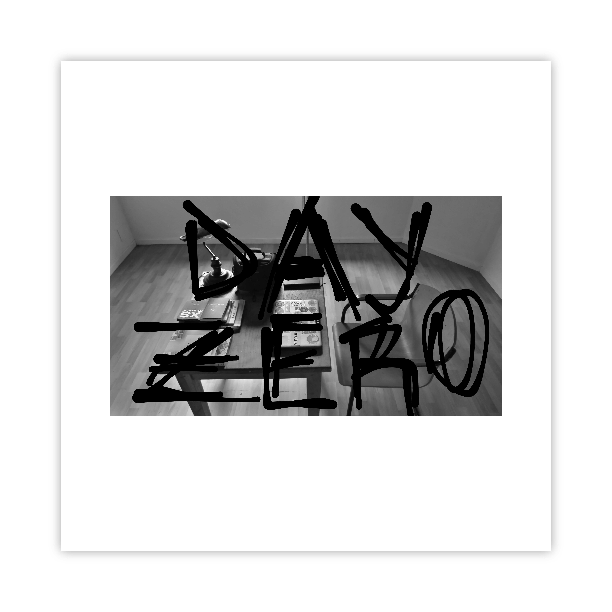
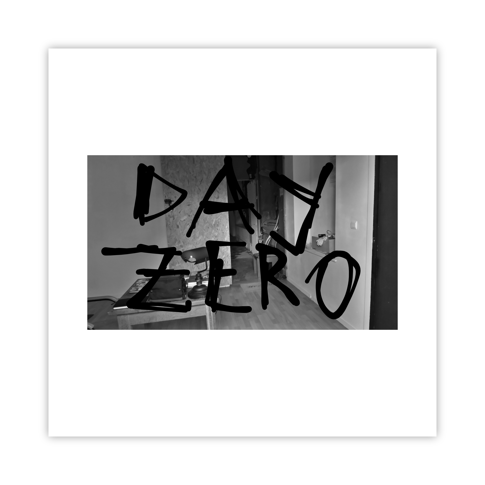
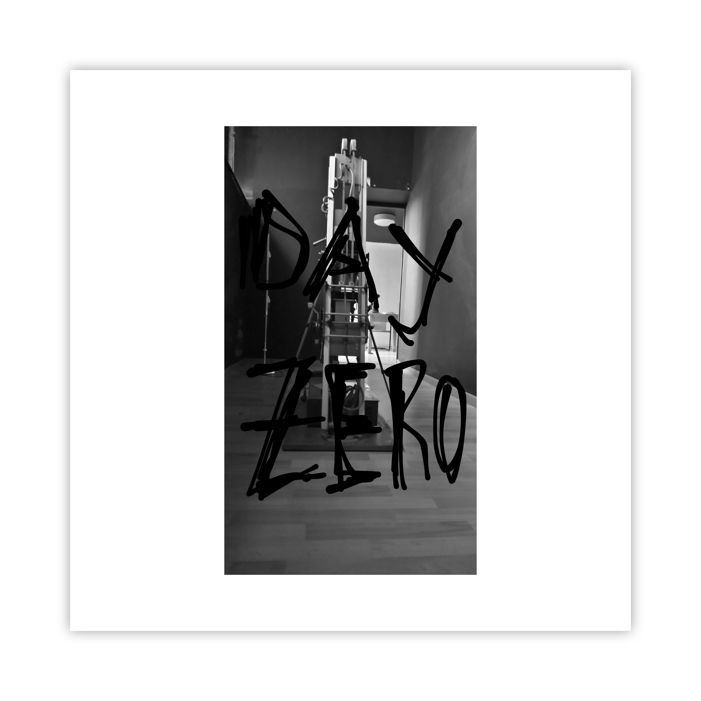
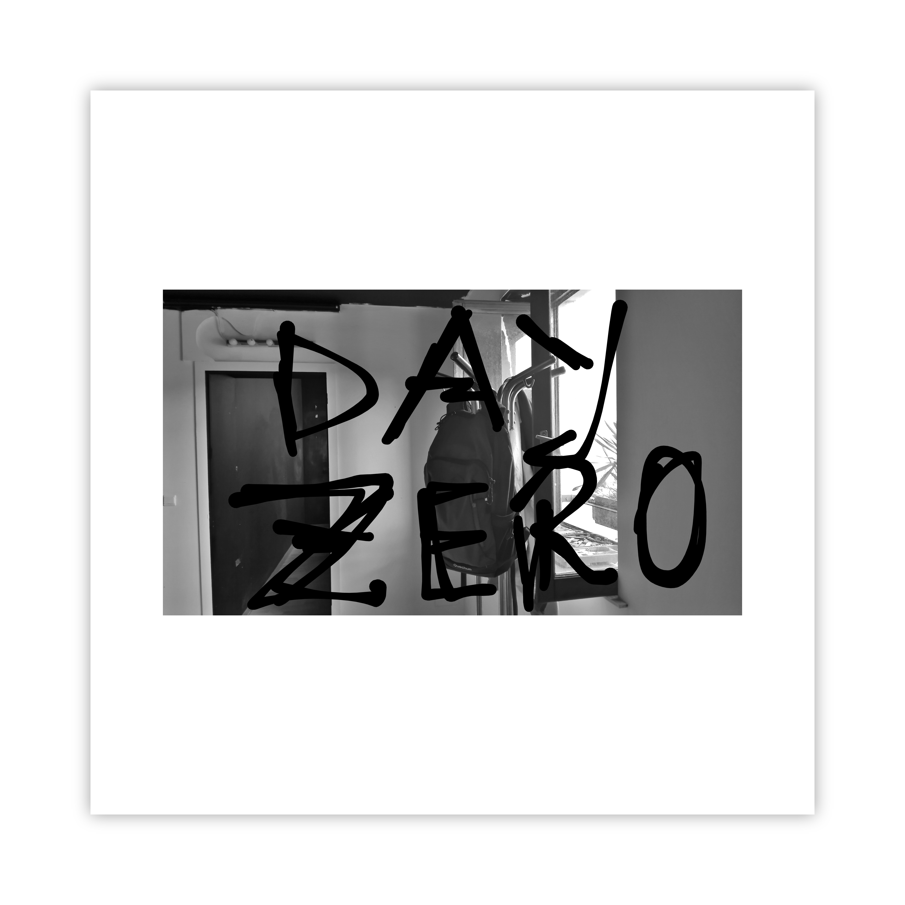
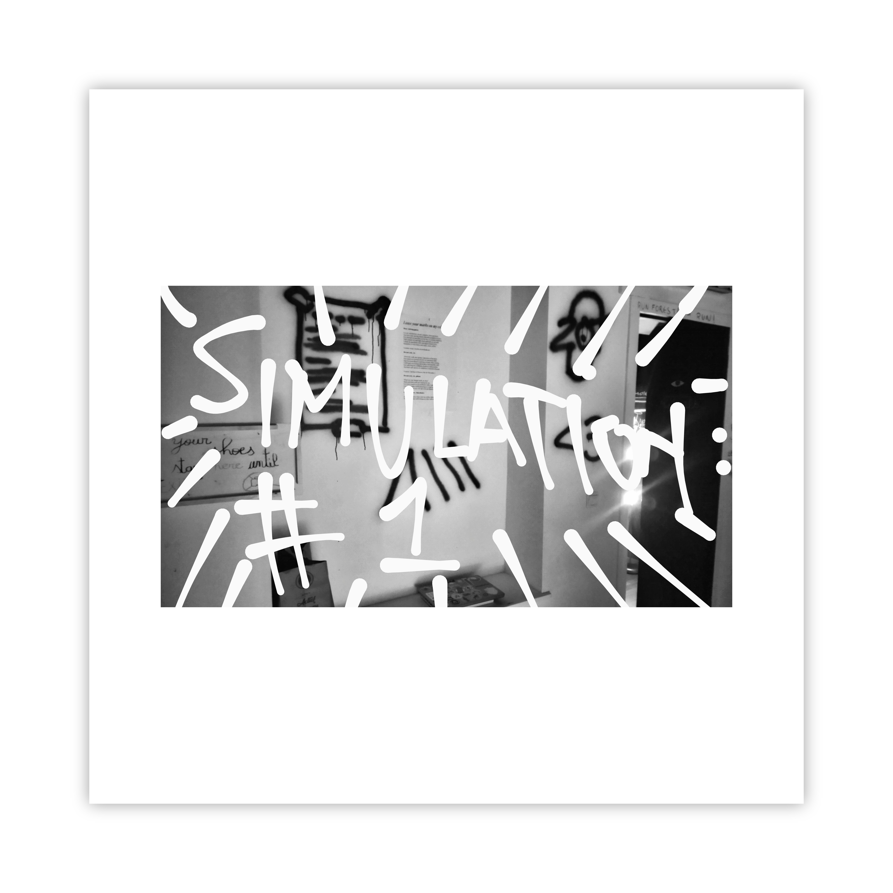
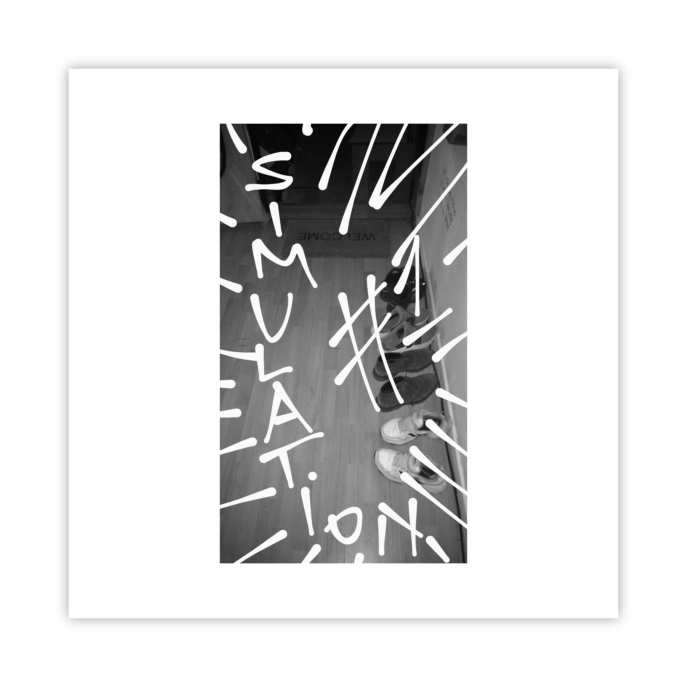
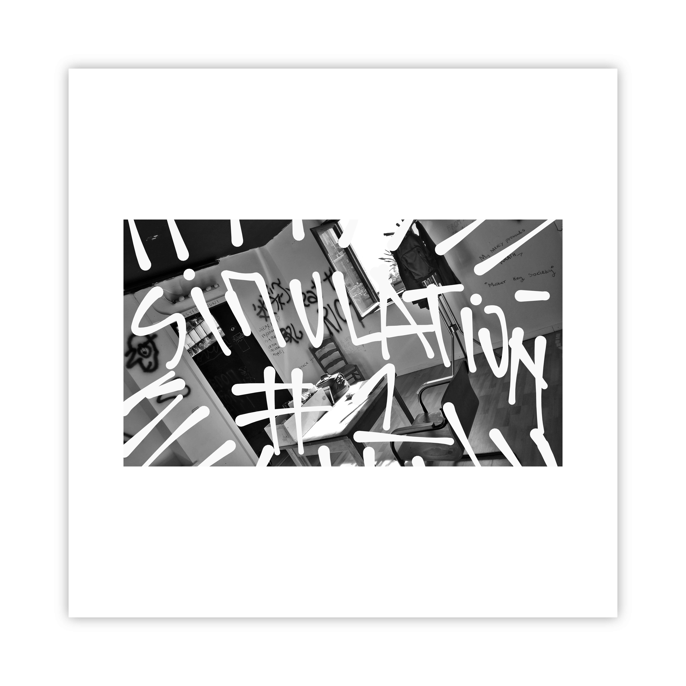
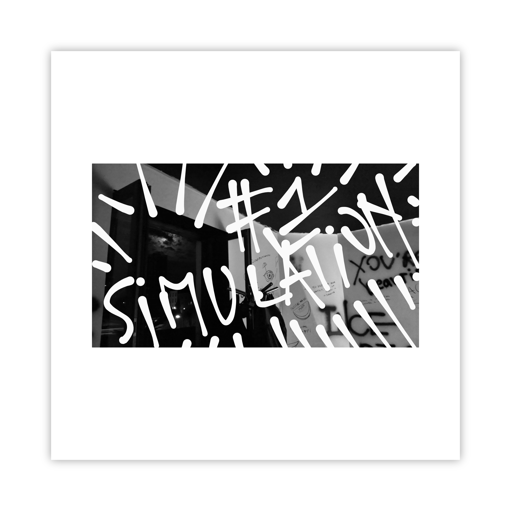
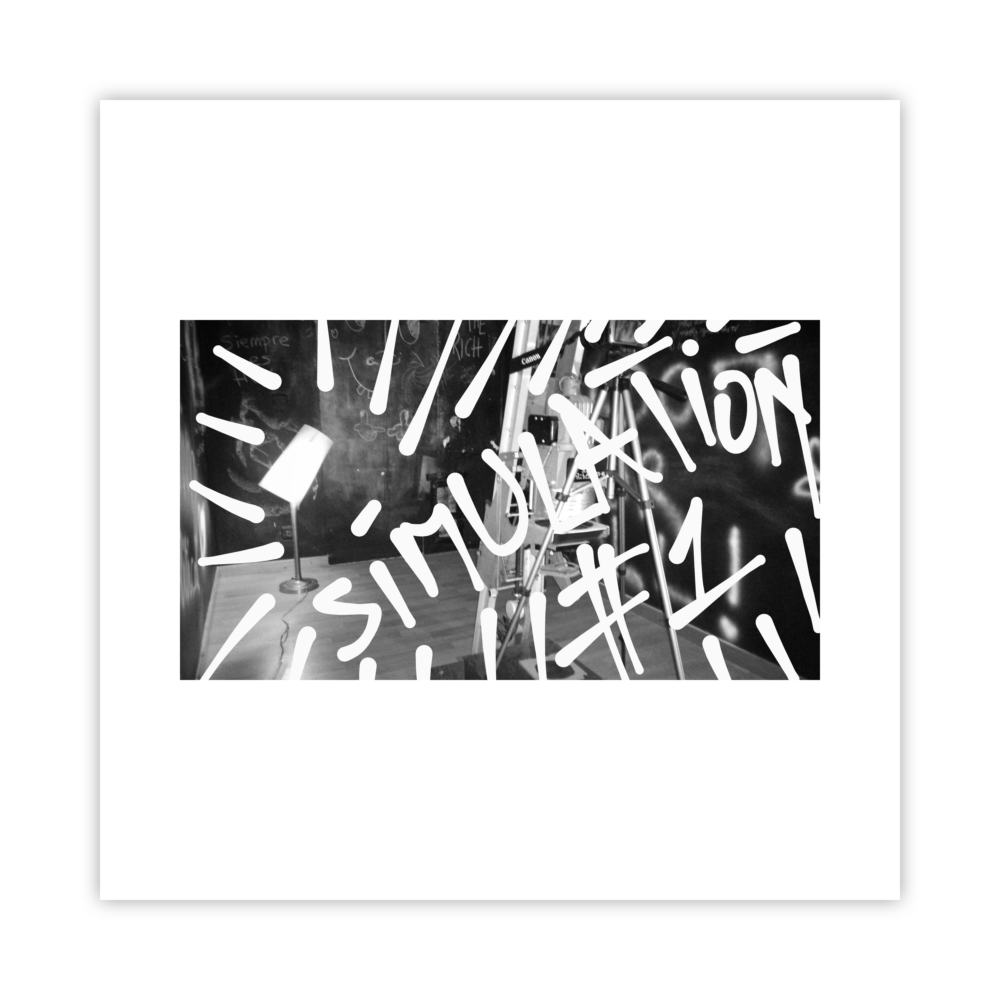
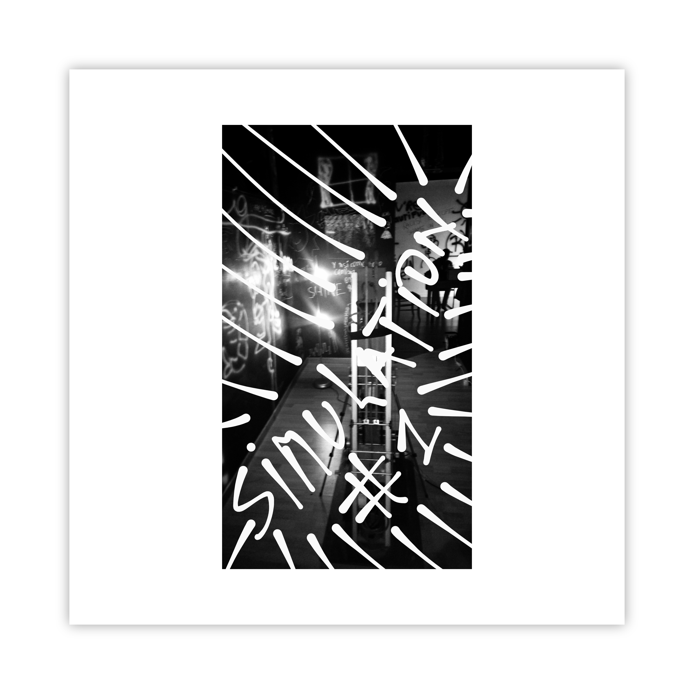

# Leave *your* marks on *my* exhibitions

## _dear visiting guest,_

Use any web browser, on any computer, from anywhere.  
Step into a fast-moving tunnel, skip asking _**daqhris**_ for keys.  
Pass through its open door, on the way to a virtual exhibition.  
Walk around, left and right, front and back, as *you* wish.   
Unlock the guestbook with _**your**_ digital identity key.  
Remember to write down _**your**_ mark, onsite, online!  

__Locations:__   
__→ [oncyber.io/awalkaday.art](https://oncyber.io/awalkaday.art)__ *(Best for PC/Mac)*    
__→ [instagram.com/walk.day](https://www.instagram.com/walk.day/reel/C3LmebUo0o4/)__ *(Best for Phone)*

## _do not exit, yet._  

Afterward, walk into another open door at [Hectolitre](http://hectolitre.space).  
_**Your**_ marks are excited to be left on centennial walls!  
_**Your**_ electronic identity card stays at home when visiting.  
_**I**_ will hand you writing tools inside of the lookalike walls.  
_**Our**_ walls keep the exhibition obedient to physical laws.  
The brick-and-mortar art exhibition is housed in [Brussels](https://www.brussels.be/brussels-art-week).  

__Location → [2nd floor of Reactor, Rue de l'Hectolitre 3](https://maps.app.goo.gl/ZXzGSwkDz2LP2gpJ9)__

## _do not exit, yet, please._  

What’s on _**your**_ human mind, _**my**_ dear?  
Black and white walls are waiting for _**you**_.  
Let’s leave a mark on the exhibition walls, _**I**_ and _**you**_.  
Ears of **our** bodies will be listening to a single audio.  
Every in-person visit will end with one digital photo!  

## _close, windows, then doors._  

[Exit](https://exhibition.awalkaday.art/) the 2-in-1 exhibition, when _**your**_ face smiles, before closing time.    
_**Your**_ mark's photo will be hung on cyber walls after [Brussels Art Week](https://rendezvousbxl.com/).    

____

> Credits:   
> - Texts, Photos, Painting & Coding: [Chris-Armel Iradukunda (daqhris)](https://daqhris.com)     
> - Sound: [caméléon.be #2](https://youtu.be/T24Tpv02TxY?feature=shared) by [Aziz InterMarrakesh](https://www.youtube.com/@abdelaaziz13030)

____

# Photo report    
## Before  

       
       
       
       
      

  

## During  

       
       
       
       
       
       
       

      
____

> *Date of last update: [7th of September 2025](https://github.com/awalkaday/exhibition/commits/main/hectolitre.md)*    
