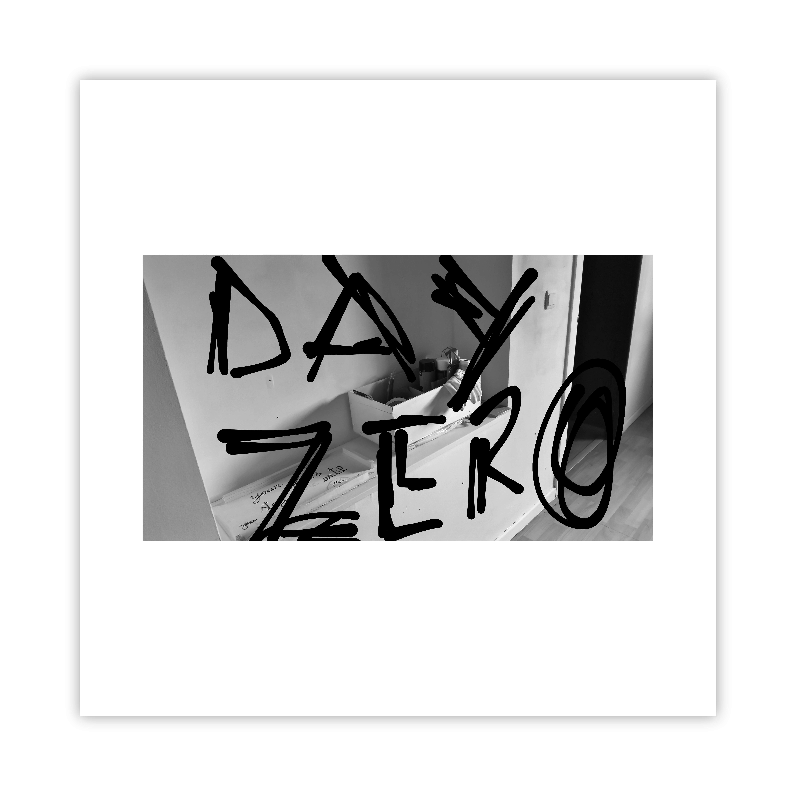

# Leave *your* marks on *my* exhibition

## _dear visiting guest,_

Use any web browser, on any computer, from anywhere.  
Step into a fast-moving tunnel, skip asking _**daqhris**_ for keys.  
Pass through its open door, on the way to a virtual exhibition.  
Walk around, left and right, front and back, as *you* wish.   
Unlock the guestbook with _**your**_ digital identity key.  
Remember to write down _**your**_ mark, onsite, online!  

__Locations:__   
__→ [oncyber.io/awalkaday.art](https://oncyber.io/awalkaday.art)__ *(Best for PC/Mac)*    
__→ [instagram.com/walk.day](https://www.instagram.com/walk.day/reel/C3LmebUo0o4/)__ *(Best for Phone)*

### _do not exit, yet._  

Afterward, walk into another open door at [Hectolitre](http://hectolitre.space).  
_**Your**_ marks are excited to be left on centennial walls!  
_**Your**_ electronic identity card stays at home when visiting.  
_**I**_ will hand you writing tools inside of the lookalike walls.  
_**Our**_ walls keep the exhibition obedient to physical laws.  
The brick-and-mortar art exhibition is housed in [Brussels](https://www.brussels.be/brussels-art-week).  

__Location → [2nd floor of Reactor, Rue de l'Hectolitre 3](https://maps.app.goo.gl/ZXzGSwkDz2LP2gpJ9)__

### _do not exit, yet, please._  

What’s on _**your**_ human mind, _**my**_ dear?  
Black and white walls are waiting for _**you**_.  
Let’s leave a mark on the exhibition walls, _**I**_ and _**you**_.  
Ears of **our** bodies will be listening to a single audio.  
Every in-person visit will end with one digital photo!  

### _close, windows, then doors._  

[Exit](https://exhibition.awalkaday.art/) the 2-in-1 exhibition, when _**your**_ face smiles, before closing time.    
_**Your**_ mark's photo will be hung on cyber walls after [RendezVous Brussels Art Week](https://rendezvousbxl.com/).    

____

> **Credits**:   
> - Texts, Photos, Painting, Design & Coding: [Chris-Armel Iradukunda (daqhris)](https://daqhris.com)     
> - Soundscape: [caméléon.be #2](https://youtu.be/T24Tpv02TxY?feature=shared) by [Aziz InterMarrakesh](https://www.youtube.com/@abdelaaziz13030)
> - Lyrical inspiration: [On Ecrit Sur Les Murs](https://www.youtube.com/watch?v=ir31nLRLXLI) by [Kids United](https://en.wikipedia.org/wiki/Kids_United)

____

## Documentation of the 2-in-1 exhibition  
_Back in February of 2024, a video tour of the virtually simulated photo exhibition was filmed in two frame sizes, [landscape](/Simulation-1/OnCyber-2024-02-15_landscape.mp4) and [square](/Simulation-1/OnCyber-2024-02-15_square.mp4), and spread out across cyberspace._ 
_Below is the visual documentation of before the opening of Hectolitre's doors, and during open hours while at least 50 visitors walked into the physical simulation of a photographer's studio._ 

### Before
_The photos portray the rooms' decor and drawings on my exhibition's walls on the 2nd floor within Reactor, where I had painted and designed a space for the occasion. 
After the interactive and participative exhibition, I drew black and white marks on them to not reveal in front of public eyes everything so early. 
They were shot, squarely edited and styled by use of apps on a smartphone in the fashion of [awalkaday.art](https://awalkaday.art) Photo Collection._

       
       
       
       
      

 

_See also: [instagram.com/walk.day/p/DORRJWSiD9p](https://www.instagram.com/walk.day/p/DORRJWSiD9p/)_

### During  
_My computer was put at the disposal of visitors to have a glimpse at the virtual exhibition hall on top of a wooden table in the middle of the white room. Chairs, a table lamp, a welcome mat and a coat hanger were present. 
A wooden box containing handwriting tools, such as chalks and spray cans (colored either in black or white), was placed near the wide-open entrance. Notice how windows remained open all the time.
At the center of the black room was situated two photographic machines embracing each other, one defunct and ancient optical enlarger for printmaking in a darkroom, and one modern Canon on standby on a tripod for photoshoots of the marks._ 

       
       
       
       
       
       
       

_See also: [instagram.com/walk.day/p/DOUDoczCDXw](https://www.instagram.com/walk.day/p/DOUDoczCDXw/)_

### After  
_To everyone who made the trip on short notice, **thank you** very much from the artistic heart of Brussels! Including the absent newborn baby of friends whose name I left on walls despite swearing to not write anywhere._

#### `COMING OUT SOON`: Photos of all marks on the walls of black and white rooms.
      
____

> *Date of last update: [24th of September 2025](https://github.com/awalkaday/exhibition/commits/main/hectolitre.md)*    
